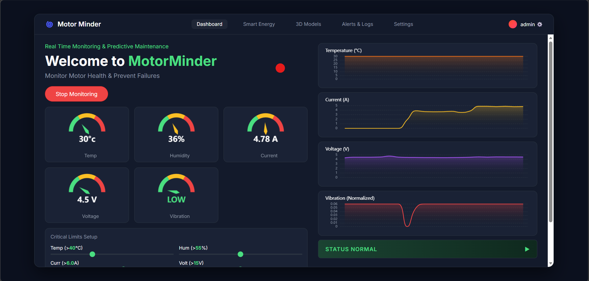

<div align="center">
  <h1>🌀 MotorMinder: IoT Digital Twin</h1>
  <p><i>Real-Time Hardware Monitoring, Predictive Maintenance, & Smart Energy Dashboard</i></p>
  
  
  
  
  
  
</div>

<br>

> **MotorMinder** is a full-stack IoT dashboard designed to monitor industrial motor health, track virtual smart energy devices, and render 3D digital twins in real-time. It features a dual-node architecture: a local Admin client that interfaces with physical hardware via the Web Serial API, and a globally accessible Public viewer synchronized via Supabase WebSockets.

 ## ✨ Key Features

* 📊 **Real-Time Telemetry:** Live gauges and line charts mapping Temperature, Humidity, Current, Voltage, and Vibration via `ECharts`.
* 🌐 **Global Synchronization:** Instantaneous data streaming from the hardware node to global viewers using **Supabase Realtime**.
* 🧊 **3D Digital Twin:** Interactive `.glb` 3D models of the motor and transformer using Google's `<model-viewer>`.
* ⚡ **Smart Energy Conservation:** Virtual device management allowing users to track, toggle, and limit energy consumption of connected sub-devices.
* 🚨 **Automated Alerting Engine:** Real-time, HTML-formatted email alerts triggered by critical sensor thresholds, powered by **EmailJS** (with built-in cooldown logic to prevent spam).
* 📱 **Responsive Dark-Mode UI:** A sleek, flexbox-driven interface that seamlessly adapts from ultra-wide desktop monitors to mobile phone screens.

## 🏗️ System Architecture

The project is split into two distinct environments to ensure security and global accessibility:

1.  **`admin.html` (Local Hardware Node):** Runs locally. Connects directly to the Arduino/ESP32 via USB using the Web Serial API. Evaluates sensor limits, triggers EmailJS alerts, and pushes data to Supabase.
2.  **`index.html` (Public Global Viewer):** Hosted on the cloud (e.g., Netlify). Contains no hardware or email logic. Strictly listens to the Supabase PostgreSQL database via WebSockets for sub-second UI updates.

## 🚀 Getting Started

### Prerequisites
* An Arduino/ESP32 streaming space-separated serial data: `Temp Hum Curr Volt Energy Vib`
* A free [Supabase](https://supabase.com/) account (for the database).
* A free [EmailJS](https://www.emailjs.com/) account (for alerts).

### Installation & Setup

1. **Clone the repository:**
   ```bash
   git clone [https://github.com/yourusername/MotorMinder.git](https://github.com/yourusername/MotorMinder.git)
   cd MotorMinder
